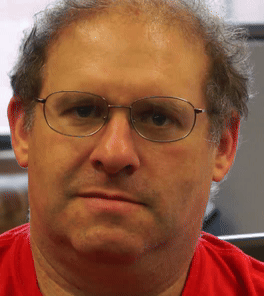
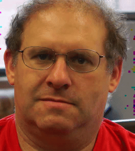
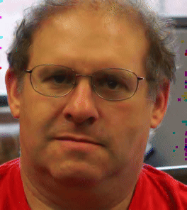

# Motion Magnification Using 2D DTCWT

[](https://github.com/joeljose/Motion-Magnification-Using-2D-DTCWT/actions/workflows/ci.yml)
[](https://colab.research.google.com/github/joeljose/Motion-Magnification-Using-2D-DTCWT/blob/main/MotionMagDtcwt.ipynb)

### Demo



**Figure 1: Original video, 2X magnified, and 5X magnified.**

---

Phase-based motion magnification amplifies subtle motions invisible to the naked eye. Unlike Eulerian (color-based) methods that amplify pixel intensity changes, phase-based magnification operates on the phase of complex wavelet coefficients — which directly encode local position — enabling 10–100x amplification with fewer artifacts. This is a Python implementation based on [Wadhwa et al. (SIGGRAPH 2013)](https://people.csail.mit.edu/nwadhwa/phase-video/) using the 2D Dual-Tree Complex Wavelet Transform.

---

## Table of Contents

- [Theory](#theory)
  - [Eulerian vs Phase-Based Motion Magnification](#eulerian-vs-phase-based-motion-magnification)
  - [Why DTCWT?](#why-dtcwt)
  - [Algorithm Pipeline](#algorithm-pipeline)
  - [Applications](#applications)
  - [Limitations](#limitations)
- [Implementation](#implementation)
  - [Phase Extraction](#phase-extraction)
  - [Temporal Filtering](#temporal-filtering)
  - [Phase Modification and Reconstruction](#phase-modification-and-reconstruction)
- [Setup](#setup)
  - [A. Google Colab](#a-google-colab)
  - [B. Local Setup](#b-local-setup)
  - [C. Docker](#c-docker)
- [Usage](#usage)
  - [CLI Tool](#cli-tool)
  - [Notebook](#notebook)
  - [Tips](#tips)
- [References](#references)

---

## Theory

### Eulerian vs Phase-Based Motion Magnification

There are two main approaches to video motion magnification:

- **Eulerian (Wu et al., SIGGRAPH 2012)** — amplifies temporal pixel intensity changes at fixed spatial locations. Works well for revealing color variations (e.g., blood flow under skin) but produces artifacts when amplifying motion beyond small factors, because the first-order Taylor approximation breaks down.

- **Phase-based (Wadhwa et al., SIGGRAPH 2013)** — operates on the phase of complex wavelet/pyramid coefficients. Phase directly encodes local spatial position, so phase changes over time directly represent motion. This supports much larger amplification factors (10–100x) with fewer artifacts because it manipulates motion information directly rather than relying on an intensity-to-motion approximation.

For a band-pass filtered signal at spatial frequency $\omega_0$, a small displacement $\delta$ produces a phase shift:

$$\Delta\phi \approx \omega_0 \cdot \delta$$

By amplifying $\Delta\phi$, we amplify $\delta$ — the actual motion.

### Why DTCWT?

The original phase-based method uses complex steerable pyramids, which are accurate but computationally expensive (~21x overcomplete). The **Dual-Tree Complex Wavelet Transform (DTCWT)**, developed by Kingsbury (Cambridge, late 1990s), provides a faster alternative.

The standard Discrete Wavelet Transform (DWT) has two problems for phase-based processing: it is not shift-invariant (shifting input by 1 pixel completely changes coefficients), and it has poor directional selectivity (only 3 sub-bands). The DTCWT solves both by running two parallel filter banks whose wavelets are related by the Hilbert transform, producing complex-valued coefficients with clean amplitude and phase information.

In 2D, the DTCWT produces **6 complex sub-bands per scale** at approximately $\pm 15°$, $\pm 45°$, $\pm 75°$:

| Property | DWT | DTCWT | Steerable Pyramid |
|---|---|---|---|
| Shift invariant | No | Approximately | Yes |
| Directional | No (3 bands) | Yes (6 bands/scale) | Yes (configurable) |
| Overcomplete | 1x | ~4x | ~21x |
| Speed | Fast | Fast | Slow |

The DTCWT is ~5x faster than complex steerable pyramids while still providing reliable phase information for motion estimation.

### Algorithm Pipeline

The algorithm has five stages:

**1. Forward 2D DTCWT**

Each video frame is decomposed into `nlevels` scales × 6 orientations, producing complex coefficients $C(s, \theta, x, y, t) = A \cdot e^{i\phi}$ where amplitude $A$ encodes texture strength and phase $\phi$ encodes spatial position.

**2. Phase Extraction**

Cumulative phase is computed via frame-to-frame complex division. For each coefficient, dividing frame $t$'s normalized value by frame $t-1$'s gives the phase ratio. Taking `angle()` and `cumsum()` produces $\phi(t)$ — the absolute phase relative to frame 0. Complex division is more numerically stable than direct phase subtraction.

**3. Temporal Filtering**

A flat-top window low-pass filter separates the phase into base motion $\phi_0$ (slow/global movement) and detail motion ($\phi - \phi_0$, the subtle variations we want to amplify).

**4. Phase Modification**

The detail motion is amplified by factor $k$:

$$\hat{\phi}(t) = \phi_0(t) + (\phi(t) - \phi_0(t)) \times k$$

An additional smoothing pass (width=2) removes high-frequency phase noise introduced by amplification.

**5. Inverse DTCWT**

Coefficients are reconstructed with the original amplitude and modified phase: $|C| \cdot e^{i\hat{\phi}}$. The inverse DTCWT produces the output video with magnified motions.

### Applications

| Application | Magnification (k) | Filter Width | What It Reveals |
|---|---|---|---|
| Pulse / breathing | 3–10 | 80–120 | Chest movement, skin motion from heartbeat |
| Structural vibration | 5–20 | 40–80 | Building sway, bridge oscillations |
| Mechanical vibration | 10–50 | 20–60 | Machine vibrations, resonance modes |
| Coronal seismology | 3–10 | 50–100 | Solar coronal loop oscillations |

### Limitations

- **Higher k → more noise/artifacts** — amplification also amplifies phase noise, producing spatial artifacts at high magnification factors.
- **Memory intensive** — all frame pyramids must remain in memory simultaneously for temporal filtering. Long videos or high resolutions may require significant RAM.
- **Slow** — DTCWT is computed on every frame × 3 color channels. Processing time scales linearly with frame count.
- **Large motions violate assumptions** — the phase-to-motion relationship is linear only for small displacements. Large motions produce phase wrapping artifacts.

---

## Implementation

### Phase Extraction

The `normalize_phase()` function normalizes complex coefficients to unit magnitude ($x / |x|$), preserving only the phase information. Elements with magnitude below $10^{-20}$ are left unchanged to avoid division by zero.

`extract_temporal_phases()` computes frame-to-frame phase changes via complex division — dividing the current frame's normalized coefficients by the previous frame's gives the phase ratio. Taking `np.angle()` converts to angles, and `np.cumsum()` along the time axis produces the absolute phase evolution relative to frame 0.

### Temporal Filtering

`flattop_filter_1d()` applies a flat-top window (from `scipy.signal.windows.flattop`) as a low-pass smoothing kernel along the time axis. The window size is `width / 0.2327`, where 0.2327 is the flat-top window's equivalent noise bandwidth in bins. This filter separates the slow baseline motion from the fast detail motion we want to amplify.

### Phase Modification and Reconstruction

After filtering, the baseline phase $\phi_0$ is subtracted from the total phase to isolate detail motion. This detail is multiplied by the magnification factor $k$, then added back: $\phi_0 + (\phi - \phi_0) \times k$.

An additional smoothing pass with width=2 removes high-frequency phase noise that would appear as spatial flickering. The final coefficients are reconstructed by preserving the original amplitude and applying the modified phase: $|h| \cdot e^{i\hat{\phi}}$.

Each color channel (R, G, B) is processed independently through the full pipeline, then recombined for the output video.

---

## Setup

### A. Google Colab

The easiest way to try the notebook — click the badge at the top of this README. No installation needed.

### B. Local Setup

**CLI tool** (recommended for processing your own videos):

```bash
git clone https://github.com/joeljose/Motion-Magnification-Using-2D-DTCWT.git
cd Motion-Magnification-Using-2D-DTCWT
pip install -r requirements.txt
python motion_mag.py -i face.mp4
```

**Notebook** (for interactive exploration and learning):

```bash
pip install -r requirements.txt requests
jupyter notebook MotionMagDtcwt.ipynb
```

**Requirements:** Python 3.8+

### C. Docker

```bash
# Build
./docker-build.sh

# Run
docker run --rm -it \
    -v "$(pwd)":/app/data \
    motion-magnification-dtcwt \
    -i /app/data/input.mp4 -o /app/data/output.avi
```

---

## Usage

### CLI Tool

```bash
python motion_mag.py -i face.mp4
python motion_mag.py -i face.mp4 -o magnified.avi -k 5
python motion_mag.py -i face.mp4 -k 3 -w 80 --nlevels 6
```

| Flag | Default | Description |
|---|---|---|
| `-i / --input` | *(required)* | Input video path |
| `-o / --output` | `<input>_magnified.avi` | Output video path |
| `-k / --magnification` | 3 | Magnification factor |
| `-w / --width` | 80 | Temporal filter width (frames) |
| `--nlevels` | 8 | DTCWT decomposition levels |
| `--version` | — | Show program version and exit |

### Notebook

Open the notebook and run all cells. By default, it downloads a sample face video from the original paper and magnifies it. To use your own video, change the `filename` variable.

### Tips

- Start with low magnification (k=3) and increase gradually.
- Larger filter width → smoother temporal filtering, better for slow motions (breathing, pulse).
- Fewer `nlevels` → faster processing but less spatial detail captured.
- R, G, B channels are processed independently — color artifacts indicate magnification is too high.

---

## References

1. Wadhwa, N., Rubinstein, M., Durand, F., & Freeman, W.T. (2013). [Phase-Based Video Motion Processing](https://people.csail.mit.edu/nwadhwa/phase-video/). *ACM Transactions on Graphics (SIGGRAPH)*, 32(4).

2. Wadhwa, N., Rubinstein, M., Durand, F., & Freeman, W.T. (2014). [Riesz Pyramids for Fast Phase-Based Video Magnification](https://people.csail.mit.edu/nwadhwa/riesz-pyramid/). *IEEE International Conference on Computational Photography (ICCP)*.

3. Anfinogentov, S. & Nakariakov, V.M. (2016). [Motion Magnification in Coronal Seismology](https://doi.org/10.1007/s11207-016-0893-4). *Solar Physics*, 291(11), 3251–3267. [GitHub](https://github.com/Sergey-Anfinogentov/motion_magnification).

4. Wu, H-Y., Rubinstein, M., Shih, E., Guttag, J., Durand, F., & Freeman, W.T. (2012). [Eulerian Video Magnification for Revealing Subtle Changes in the World](https://people.csail.mit.edu/mrub/papers/vidmag.pdf). *ACM Transactions on Graphics (SIGGRAPH)*, 31(4).

5. Kingsbury, N.G. (1998). The Dual-Tree Complex Wavelet Transform: A New Technique for Shift Invariance and Directional Filters. *IEEE DSP Workshop*.

6. [MIT CSAIL — Eulerian Video Magnification Project Page](https://people.csail.mit.edu/mrub/evm/)

---

## Follow Me
<a href="https://x.com/joelk1jose" target="_blank"></a>&nbsp;&nbsp;
<a href="https://github.com/joeljose" target="_blank"></a>&nbsp;&nbsp;
<a href="https://www.linkedin.com/in/joel-jose-527b80102/" target="_blank"></a>

<h3 align="center">Show your support by starring the repository 🙂</h3>
