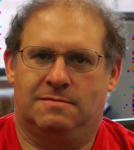

# Motion Magnification Using 2D DTCWT

[](https://github.com/joeljose/Motion-Magnification-Using-2D-DTCWT/actions/workflows/ci.yml)
[](https://colab.research.google.com/github/joeljose/Motion-Magnification-Using-2D-DTCWT/blob/main/MotionMagDtcwt.ipynb)

### Demo



**Figure 1: Original video, 2X magnified, and 5X magnified.**

---

Phase-based motion magnification amplifies subtle motions invisible to the naked eye. Unlike Eulerian (color-based) methods that amplify pixel intensity changes, phase-based magnification operates on the phase of complex wavelet coefficients — which directly encode local position — enabling 10–100x amplification with fewer artifacts. This is a Python implementation based on [Wadhwa et al. (SIGGRAPH 2013)](https://people.csail.mit.edu/nwadhwa/phase-video/) using the 2D Dual-Tree Complex Wavelet Transform.

**v2.0.0** adds GPU acceleration via PyTorch, delivering ~5x end-to-end speedup on CUDA-capable GPUs.

---

## Table of Contents

- [Theory](#theory)
  - [Eulerian vs Phase-Based Motion Magnification](#eulerian-vs-phase-based-motion-magnification)
  - [Why DTCWT?](#why-dtcwt)
  - [Algorithm Pipeline](#algorithm-pipeline)
  - [Applications](#applications)
  - [Limitations](#limitations)
- [Implementation](#implementation)
  - [Phase Extraction](#phase-extraction)
  - [Temporal Filtering](#temporal-filtering)
  - [Phase Modification and Reconstruction](#phase-modification-and-reconstruction)
- [GPU Acceleration](#gpu-acceleration)
  - [Two-Pass Batched Architecture](#two-pass-batched-architecture)
  - [Chunked cuFFT Temporal Filtering](#chunked-cufft-temporal-filtering)
  - [Design Decisions](#design-decisions)
  - [Performance](#performance)
- [Setup](#setup)
  - [A. Google Colab](#a-google-colab)
  - [B. Local Setup](#b-local-setup)
  - [C. Docker (CPU)](#c-docker-cpu)
  - [D. Docker (GPU)](#d-docker-gpu)
- [Usage](#usage)
  - [CLI Tool](#cli-tool)
  - [Notebook](#notebook)
  - [Tips](#tips)
- [v2.0.0 Breaking Changes](#v200-breaking-changes)
- [Development](#development)
  - [Running Tests](#running-tests)
  - [Versioning](#versioning)
  - [Project Structure](#project-structure)
- [References](#references)

---

## Theory

### Eulerian vs Phase-Based Motion Magnification

There are two main approaches to video motion magnification:

- **Eulerian (Wu et al., SIGGRAPH 2012)** — amplifies temporal pixel intensity changes at fixed spatial locations. Works well for revealing color variations (e.g., blood flow under skin) but produces artifacts when amplifying motion beyond small factors, because the first-order Taylor approximation breaks down.

- **Phase-based (Wadhwa et al., SIGGRAPH 2013)** — operates on the phase of complex wavelet/pyramid coefficients. Phase directly encodes local spatial position, so phase changes over time directly represent motion. This supports much larger amplification factors (10–100x) with fewer artifacts because it manipulates motion information directly rather than relying on an intensity-to-motion approximation.

For a band-pass filtered signal at spatial frequency $\omega_0$, a small displacement $\delta$ produces a phase shift:

$$\Delta\phi \approx \omega_0 \cdot \delta$$

By amplifying $\Delta\phi$, we amplify $\delta$ — the actual motion.

### Why DTCWT?

The original phase-based method uses complex steerable pyramids, which are accurate but computationally expensive (~21x overcomplete). The **Dual-Tree Complex Wavelet Transform (DTCWT)**, developed by Kingsbury (Cambridge, late 1990s), provides a faster alternative.

The standard Discrete Wavelet Transform (DWT) has two problems for phase-based processing: it is not shift-invariant (shifting input by 1 pixel completely changes coefficients), and it has poor directional selectivity (only 3 sub-bands). The DTCWT solves both by running two parallel filter banks whose wavelets are related by the Hilbert transform, producing complex-valued coefficients with clean amplitude and phase information.

In 2D, the DTCWT produces **6 complex sub-bands per scale** at approximately $\pm 15°$, $\pm 45°$, $\pm 75°$:

| Property | DWT | DTCWT | Steerable Pyramid |
|---|---|---|---|
| Shift invariant | No | Approximately | Yes |
| Directional | No (3 bands) | Yes (6 bands/scale) | Yes (configurable) |
| Overcomplete | 1x | ~4x | ~21x |
| Speed | Fast | Fast | Slow |

The DTCWT is ~5x faster than complex steerable pyramids while still providing reliable phase information for motion estimation.

### Algorithm Pipeline

The algorithm has five stages:

```
Input Video
    |
    v
[1. Forward 2D DTCWT] ──> Complex coefficients C = A * e^(i*phi)
    |                       (nlevels scales x 6 orientations per frame)
    v
[2. Phase Extraction] ──> Cumulative phase phi(t) via frame-to-frame
    |                      complex division + cumsum
    v
[3. Temporal Filter] ──> Separate base motion phi_0 (slow)
    |                     from detail motion (phi - phi_0)
    v
[4. Phase Modification] ──> Amplify detail: phi_0 + (phi - phi_0) * k
    |                        + smoothing pass (width=2)
    v
[5. Inverse DTCWT] ──> Reconstruct with |C| * e^(i*phi_modified)
    |
    v
Output Video (magnified motions)
```

Each color channel (R, G, B) is processed independently through the full pipeline, then recombined for the output video.

**1. Forward 2D DTCWT**

Each video frame is decomposed into `nlevels` scales × 6 orientations, producing complex coefficients $C(s, \theta, x, y, t) = A \cdot e^{i\phi}$ where amplitude $A$ encodes texture strength and phase $\phi$ encodes spatial position.

**2. Phase Extraction**

Cumulative phase is computed from frame-to-frame phase changes. For each coefficient, multiplying frame $t$'s normalized value by the conjugate of frame $t-1$'s gives the phase change. Taking `angle()` and `cumsum()` produces $\phi(t)$ — the absolute phase relative to frame 0. This handles phase wrapping at $\pm\pi$, unlike subtracting angles, and a zero coefficient gives no phase change.

**3. Temporal Filtering**

A flat-top window low-pass filter separates the phase into base motion $\phi_0$ (slow/global movement) and detail motion ($\phi - \phi_0$, the subtle variations we want to amplify).

**4. Phase Modification**

The detail motion is amplified by factor $k$:

$$\hat{\phi}(t) = \phi_0(t) + (\phi(t) - \phi_0(t)) \times k$$

An additional smoothing pass (width=2) removes high-frequency phase noise introduced by amplification.

**5. Inverse DTCWT**

Coefficients are reconstructed with the original amplitude and modified phase: $|C| \cdot e^{i\hat{\phi}}$. The inverse DTCWT produces the output video with magnified motions.

### Applications

| Application | Magnification (k) | Filter Width | What It Reveals |
|---|---|---|---|
| Pulse / breathing | 3–10 | 80–120 | Chest movement, skin motion from heartbeat |
| Structural vibration | 5–20 | 40–80 | Building sway, bridge oscillations |
| Mechanical vibration | 10–50 | 20–60 | Machine vibrations, resonance modes |
| Coronal seismology | 3–10 | 50–100 | Solar coronal loop oscillations |

### Limitations

- **Higher k → more noise/artifacts** — amplification also amplifies phase noise, producing spatial artifacts at high magnification factors.
- **Memory intensive** — all frame pyramids must remain in memory simultaneously for temporal filtering. Long videos or high resolutions may require significant RAM.
- **Slow on CPU** — DTCWT is computed on every frame × 3 color channels. Processing time scales linearly with frame count. Use `--gpu` for ~5x speedup.
- **Large motions violate assumptions** — the phase-to-motion relationship is linear only for small displacements. Large motions produce phase wrapping artifacts.

---

## Implementation

### Phase Extraction

The `normalize_phase()` function normalizes complex coefficients to unit magnitude ($x / |x|$), preserving only the phase information. Elements with magnitude below $10^{-20}$ are left unchanged to avoid division by zero.

`extract_temporal_phases()` computes frame-to-frame phase changes by multiplying the current frame's normalized coefficients by the conjugate of the previous frame's. Taking `np.angle()` converts to angles, and `np.cumsum()` along the time axis produces the absolute phase evolution relative to frame 0.

### Temporal Filtering

`flattop_filter_1d()` applies a flat-top window (from `scipy.signal.windows.flattop`) as a low-pass smoothing kernel along the time axis. The window length is `round(width / 0.2327)`, forced odd so the filter is zero-phase. 0.2327 is an empirical width-to-length factor carried over from the reference IDL implementation (it is not the window's equivalent noise bandwidth, which is about 3.77 bins). This filter separates the slow baseline motion from the faster detail motion we want to amplify.

In frequency terms, at 30 fps with the default `-w 80` the baseline filter (345 taps) has its half-amplitude point at about **0.20 Hz**, and the final smoothing filter (width 2, 9 taps) at about **8.6 Hz**. So motion between roughly 0.2 and 8.6 Hz is amplified. Both cutoffs scale with the frame rate, and the lower one scales inversely with `width`.

For windows larger than 32 samples, the filter switches to FFT-based convolution (`scipy.signal.fftconvolve`) for a ~4x speedup. Both paths use the same boundary rule (the edge sample repeated, i.e. ndimage `reflect`), and a test checks that they agree to 1e-10.

### Phase Modification and Reconstruction

After filtering, the baseline phase $\phi_0$ is subtracted from the total phase to isolate detail motion. This detail is multiplied by the magnification factor $k$, then added back: $\phi_0 + (\phi - \phi_0) \times k$.

An additional smoothing pass with width=2 removes high-frequency phase noise that would appear as spatial flickering. The final coefficients are reconstructed by preserving the original amplitude and applying the modified phase: $|h| \cdot e^{i\hat{\phi}}$.

---

## GPU Acceleration

The `--gpu` flag enables GPU-accelerated processing via [PyTorch](https://pytorch.org/) and [`pytorch_wavelets`](https://github.com/fbcotter/pytorch_wavelets). The GPU path replaces both the DTCWT transforms and temporal filtering with CUDA-accelerated equivalents while keeping the same algorithmic pipeline.

### Two-Pass Batched Architecture

Storing all DTCWT coefficients (amplitudes + phases) for every frame would require ~718 MB of CPU RAM per channel. The GPU path avoids this with a two-pass design:

**Pass 1 — Forward DTCWT + Phase Extraction:**
- Frames are sent to the GPU in batches (batch size sized to ~70% of free VRAM; halved and retried on an out-of-memory error)
- Forward DTCWT produces complex coefficients; only the **phase** is extracted and stored on CPU
- Amplitudes and lowpass coefficients (Yl) are **discarded** — they will be recomputed in Pass 2
- Cross-batch boundary handling carries the last frame's normalized coefficients to the next batch, so batched results match single-batch processing to float32 precision (tested to 1e-5)

**Temporal Filtering on GPU** (between passes):
- Phase arrays are filtered using cuFFT (see below)

**Pass 2 — Reconstruction + Inverse DTCWT:**
- Forward DTCWT is re-run on the original frames to recover amplitudes and Yl (deterministic — verified 0.00 diff between runs)
- Modified phases from the filtered output are combined with recovered amplitudes: `real = amp * cos(phase)`, `imag = amp * sin(phase)`
- Inverse DTCWT produces the output frames

### Chunked cuFFT Temporal Filtering

The temporal filter is the pipeline bottleneck (54% of CPU runtime). On GPU, it uses `torch.fft` (backed by cuFFT):

1. Phase arrays are chunked along the coefficient dimension to fit in VRAM — cuFFT requires ~20x the array size in working memory, so a 538 MB phase array would need ~3.8 GB for a whole-array FFT
2. Each chunk is transferred to GPU, FFT'd along the time axis, multiplied by the pre-computed FFT of the flat-top window, then inverse FFT'd
3. The magnification and smoothing passes are applied on-GPU before transferring back

**Chunk size auto-tuning:** queries `torch.cuda.mem_get_info()` and sizes chunks to 50% of free VRAM (the DTCWT batches use 70%), adapting to any GPU without user configuration. A chunk that still runs out of memory is halved and retried.

**Boundary handling:** Each chunk is padded along time on the CPU with the same rule as the CPU path before the FFT, so the GPU and CPU paths agree at the first and last frames too.

### Design Decisions

| Decision | Choice | Why |
|---|---|---|
| Two-pass vs store amplitudes | Two-pass (recompute) | Saves ~718 MB RAM/channel; forward DTCWT is deterministic, adds <1s on GPU |
| C=1 sequential vs C=3 batched | 3x C=1 sequential | C=3 only speeds DTCWT (22% of pipeline) by 2.2x but costs 2.5x VRAM; 1.2x total speedup not worth the complexity |
| Float32 vs float64 | Float32 everywhere | PyTorch/CUDA standard; cumsum error max 2.4e-4 rad at 900 frames, 1000x below visibility threshold |
| Whole-array vs chunked cuFFT | Chunked | Whole-array OOMs on consumer GPUs (>100 frames at 528x592); chunking is still 3x faster than CPU FFT |
| Padding for the GPU FFT | Same boundary rule as CPU, padded on CPU | Costs one extra half-window of frames per chunk; keeps the edges identical to the CPU path |

See [`docs/design/gpu-acceleration.md`](docs/design/gpu-acceleration.md) for the full design document including alternatives considered and tradeoff analysis.

### Performance

Benchmarked on face.mp4 (301 frames, 528x592, k=3, nlevels 8) with an RTX 4050 Laptop GPU (6 GB VRAM); peak RAM is measured `ru_maxrss` inside Docker:

| Metric | CPU | GPU |
|---|---|---|
| Per-channel speedup | — | ~5-17x |
| End-to-end time | ~1 min 40 s | ~24 sec |
| Precision | float32 / complex64 | float32 |
| Peak RAM | 2.9 GiB | 2.8 GiB |
| Peak VRAM | — | ~2-3 GB |

**Hardware requirements (GPU path):**
- NVIDIA GPU with CUDA 12.1+ support
- Minimum ~4 GB VRAM recommended (auto-tuning adapts batch/chunk sizes)
- [`nvidia-container-toolkit`](https://docs.nvidia.com/datacenter/cloud-native/container-toolkit/latest/install-guide.html) for Docker GPU support

**Memory check:** After loading the video, the tool prints its estimate of peak CPU RAM and warns if it exceeds the available memory (read from `/proc/meminfo` on Linux). CPU peak RAM grows linearly with frame count × resolution: roughly 33 bytes per pixel per frame (about 2.9 GiB for face.mp4).

**Note:** CPU and GPU paths use different DTCWT implementations (`dtcwt` vs `pytorch_wavelets`) with the same filters. A test checks they agree on a moving clip (PSNR >= 60 dB; measured about 115 dB), so outputs differ only at the float32 precision level.

---

## Setup

### A. Google Colab

The easiest way to try the notebook — click the badge at the top of this README. No installation needed.

### B. Local Setup

**CLI tool** (recommended for processing your own videos):

```bash
git clone https://github.com/joeljose/Motion-Magnification-Using-2D-DTCWT.git
cd Motion-Magnification-Using-2D-DTCWT
pip install -r requirements.txt
python motion_mag.py -i face.mp4
```

**Notebook** (for interactive exploration and learning):

```bash
pip install -r requirements.txt jupyter matplotlib
jupyter notebook MotionMagDtcwt.ipynb
```

**Requirements:** Python 3.10–3.12. `dtcwt` does not work with NumPy 2, so NumPy is capped below 2, and NumPy 1.x has no wheels for Python 3.13+. Tested with the exact versions in `requirements.lock` (Python 3.11) and `requirements-gpu.lock` (Python 3.10).

### C. Docker (CPU)

```bash
# Build
./docker-build.sh

# Run
docker run --rm -it --user "$(id -u):$(id -g)" \
    -v "$(pwd)":/app/data \
    motion-mag-dtcwt:latest \
    -i /app/data/input.mp4 -o /app/data/output.avi
```

### D. Docker (GPU)

Requires [nvidia-container-toolkit](https://docs.nvidia.com/datacenter/cloud-native/container-toolkit/latest/install-guide.html).

```bash
# Build
./docker-build-gpu.sh

# Run
docker run --rm -it --gpus all --user "$(id -u):$(id -g)" \
    -v "$(pwd)":/app/data \
    motion-mag-dtcwt-gpu:latest \
    -i /app/data/input.mp4 -o /app/data/output.avi
```

Both images run as a fixed non-root user (`app`, UID 1000). `--user "$(id -u):$(id -g)"` makes the output files in the mounted folder belong to you; without it, the folder must be writable by UID 1000.

The GPU Docker image is based on `pytorch/pytorch:2.1.2-cuda12.1-cudnn8-runtime` and includes PyTorch, `pytorch_wavelets`, and all dependencies. The GPU image's entrypoint passes `--gpu`, so it always uses the GPU path; the CLI prints the active backend under **Parameters**. To run the CPU path, use the CPU image.

---

## Usage

### CLI Tool

```bash
# CPU (default)
python motion_mag.py -i face.mp4
python motion_mag.py -i face.mp4 -o magnified.avi -k 5
python motion_mag.py -i face.mp4 -k 3 -w 80 --nlevels 6

# GPU
python motion_mag.py -i face.mp4 --gpu
python motion_mag.py -i face.mp4 --gpu --device 1 -k 10
python motion_mag.py -i face.mp4 --gpu -k 5 --biort near_sym_a --qshift qshift_a
```

| Flag | Default | Description |
|---|---|---|
| `-i / --input` | *(required)* | Input video path |
| `-o / --output` | `<input>_magnified.avi` | Output video path |
| `-k / --magnification` | 3 | Magnification factor |
| `-w / --width` | 80 | Temporal filter width (frames) |
| `--nlevels` | 8 | DTCWT decomposition levels |
| `--fps` | from input | Output frame rate; required when the input doesn't report one |
| `--gpu` | off | Enable GPU acceleration (requires PyTorch + pytorch_wavelets) |
| `--device` | 0 | CUDA device index (for multi-GPU systems) |
| `--biort` | `near_sym_b` | Biorthogonal wavelet filter for DTCWT level 1 |
| `--qshift` | `qshift_b` | Quarter-shift wavelet filter for DTCWT levels 2+ |
| `--version` | — | Show program version and exit |

**Available wavelet filters:**
- `--biort`: `antonini`, `legall`, `near_sym_a`, `near_sym_b`
- `--qshift`: `qshift_06`, `qshift_a`, `qshift_b`, `qshift_c`, `qshift_d`

### Notebook

Open the notebook and run all cells. It calls `motion_mag.py` (cloning the repository first when run on Colab), magnifies the bundled `face.mp4`, saves `face_k3.avi`, and plots a before/after comparison. To use your own video, change the `filename` variable.

### Tips

- Start with low magnification (k=3) and increase gradually.
- Larger filter width → smoother temporal filtering, better for slow motions (breathing, pulse).
- Fewer `nlevels` → faster processing but less spatial detail captured.
- R, G, B channels are processed independently — color artifacts indicate magnification is too high.
- Use `--gpu` for ~5x faster processing if you have an NVIDIA GPU.

---

## v2.0.0 Breaking Changes

- **Default wavelet filters changed** from `near_sym_a`/`qshift_a` to `near_sym_b`/`qshift_b`. The longer `near_sym_b` filters produce fewer block artifacts at higher magnification factors (k=5+). To restore v1.x behavior:
  ```bash
  python motion_mag.py -i input.mp4 --biort near_sym_a --qshift qshift_a
  ```
- **Output differs from v1.x** even on CPU due to the filter change. Pin filters explicitly if reproducibility with older versions is needed.

See [CHANGELOG.md](CHANGELOG.md) for full release history.

---

## Development

### Running Tests

All tests run inside Docker — no local Python dependencies needed:

```bash
# CPU: lint + unit tests (builds image automatically if not found)
./test.sh

# GPU: lint + unit tests including CUDA tests (requires nvidia-container-toolkit)
./test.sh gpu

# Force rebuild before testing
./test.sh --build
./test.sh gpu --build
```

**CPU tests** (`tests/test_motion_mag.py`) cover:
- Phase normalization and temporal phase extraction, including exact-zero coefficients
- Flat-top temporal filter: FFT path equal to direct convolution (edges included), zero-phase on a linear ramp
- `magnify_motions`: k=1 reproduces a static clip, a sub-pixel oscillation is magnified about k times, odd frame sizes, uint8 input
- **Golden regression**: a 20-frame crop of face.mp4 must match `tests/data/golden_face.npz` (PSNR >= 60 dB). Regenerate it with `python scripts/make_golden.py` only for intended output changes, and note them in CHANGELOG.md
- Memory estimation arithmetic
- `load_video` / `save_video` error handling, and CLI runs on a real 12-frame clip (output frame count and size checked)
- All CLI input validation error paths

**GPU tests** (`tests/test_motion_mag_gpu.py`) cover:
- GPU forward/inverse DTCWT roundtrip (float32 precision)
- Phase extraction (finite values, correct shapes)
- Batched vs single-batch consistency (cross-batch boundary verification)
- cuFFT temporal filter (shape preservation, DC signal handling)
- Full GPU pipeline smoke test (finite output, correct dimensions, odd frame sizes)
- Out-of-memory retry with smaller batches (simulated OOM), and agreement with the CPU path (PSNR >= 60 dB)
- They run on CUDA when available and otherwise on CPU tensors; CI runs them with the CPU build of PyTorch. They skip only when torch or pytorch_wavelets is not installed

**Dev workflow:**
1. Make your changes
2. Run `./test.sh` (and `./test.sh gpu` if touching GPU code)
3. If all tests pass, commit and open a PR
4. CI runs lint, the unit tests, a full run on face.mp4, and the GPU-path tests on CPU PyTorch automatically

### Versioning

Version is tracked in a `VERSION` file at the project root. `motion_mag.py` has `__version__` baked into the source (updated at release time); a unit test fails if the two differ.

**To cut a release:**
1. Update `VERSION` with the new version number
2. Update `__version__` in `motion_mag.py`
3. Update `CHANGELOG.md` — move items from `[Unreleased]` to `[X.Y.Z] - YYYY-MM-DD`
4. Commit: `Release vX.Y.Z`
5. Tag: `git tag -a vX.Y.Z -m "Release vX.Y.Z"`
6. Push: `git push && git push origin vX.Y.Z`
7. Rebuild Docker images: `./docker-build.sh && ./docker-build-gpu.sh`

### Project Structure

```
motion_mag.py              # CLI tool (CPU + GPU paths)
MotionMagDtcwt.ipynb       # Jupyter notebook
Dockerfile                 # CPU Docker image (python:3.11-slim)
Dockerfile.gpu             # GPU Docker image (pytorch:2.1.2-cuda12.1)
docker-build.sh            # Build + tag CPU image
docker-build-gpu.sh        # Build + tag GPU image
test.sh                    # Run lint + tests (Docker, supports cpu/gpu mode)
requirements.txt           # CPU runtime dependencies (version ranges)
requirements-gpu.txt       # GPU runtime dependencies (version ranges)
requirements-dev.txt       # Dev dependencies (pytest, ruff)
requirements.lock          # Hash-locked CPU image dependencies
requirements-gpu.lock      # Hash-locked GPU image dependencies
pyproject.toml             # ruff configuration
scripts/
  verify_output.py         # CI check of the pipeline output
  make_golden.py           # Regenerates tests/data/golden_face.npz
tests/
  test_motion_mag.py       # CPU unit tests
  test_motion_mag_gpu.py   # GPU-path tests (CUDA, or CPU tensors with CPU PyTorch)
  data/golden_face.npz     # Golden regression data
docs/design/               # Architecture decision records
  gpu-acceleration.md      # GPU design doc
  dtcwt-hardening.md       # Hardening design doc
VERSION                    # Release version (a test checks it matches __version__)
CHANGELOG.md               # Release history
CONTRIBUTING.md            # Contribution guidelines
```

---

## References

1. Wadhwa, N., Rubinstein, M., Durand, F., & Freeman, W.T. (2013). [Phase-Based Video Motion Processing](https://people.csail.mit.edu/nwadhwa/phase-video/). *ACM Transactions on Graphics (SIGGRAPH)*, 32(4).

2. Wadhwa, N., Rubinstein, M., Durand, F., & Freeman, W.T. (2014). [Riesz Pyramids for Fast Phase-Based Video Magnification](https://people.csail.mit.edu/nwadhwa/riesz-pyramid/). *IEEE International Conference on Computational Photography (ICCP)*.

3. Anfinogentov, S. & Nakariakov, V.M. (2016). [Motion Magnification in Coronal Seismology](https://doi.org/10.1007/s11207-016-0893-4). *Solar Physics*, 291(11), 3251–3267. [GitHub](https://github.com/Sergey-Anfinogentov/motion_magnification).

4. Wu, H-Y., Rubinstein, M., Shih, E., Guttag, J., Durand, F., & Freeman, W.T. (2012). [Eulerian Video Magnification for Revealing Subtle Changes in the World](https://people.csail.mit.edu/mrub/papers/vidmag.pdf). *ACM Transactions on Graphics (SIGGRAPH)*, 31(4).

5. Kingsbury, N.G. (1998). The Dual-Tree Complex Wavelet Transform: A New Technique for Shift Invariance and Directional Filters. *IEEE DSP Workshop*.

6. [MIT CSAIL — Eulerian Video Magnification Project Page](https://people.csail.mit.edu/mrub/evm/)

---

## Follow Me
<a href="https://x.com/joelk1jose" target="_blank"></a>&nbsp;&nbsp;
<a href="https://github.com/joeljose" target="_blank"></a>&nbsp;&nbsp;
<a href="https://www.linkedin.com/in/joel-jose-527b80102/" target="_blank"></a>

<h3 align="center">Show your support by starring the repository 🙂</h3>
