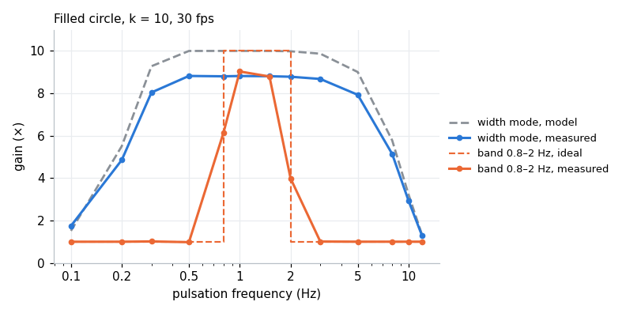
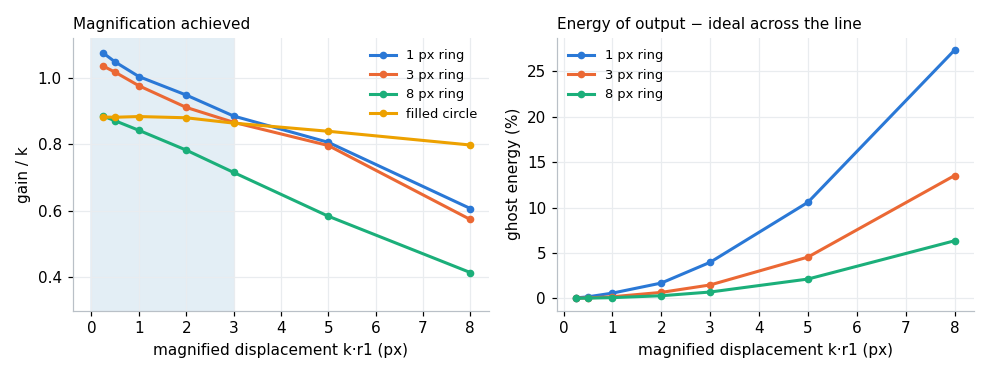
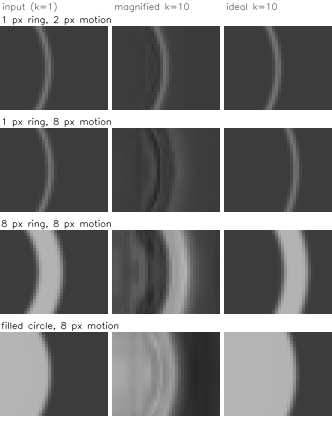
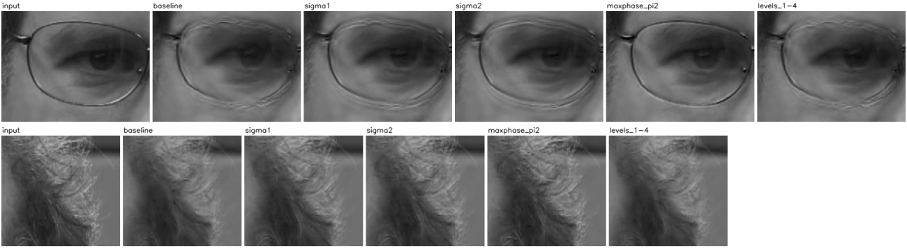

# Synthetic validation and high-k artefacts

Research notes for issue #39 ("Reduce artefacts at high k"). They check the magnification against exact ground truth, explain the systematic effects that show up, and record how the three proposed fixes performed.

- Scripts: [`scripts/synthetic_shapes.py`](../../scripts/synthetic_shapes.py) (pulsating shapes) and [`scripts/bench_high_k.py`](../../scripts/bench_high_k.py) (textured scene and face.mp4).
- Permanent checks: [`tests/test_synthetic_shapes.py`](../../tests/test_synthetic_shapes.py).
- Setup unless noted: k = 10, 30 fps, 128×128 frames, `nlevels` 5, default flat-top filter (`-w 80`), CPU path. Edges are blurred with a Gaussian of σ = 0.8 px, like a camera's point spread, so sub-pixel sizes are exact.

## Summary

| Finding | Status |
|---|---|
| Gain against frequency follows the flat-top filter model from 0.1 to 12 Hz, with zero phase lag. Band mode gives about 9× inside 0.8–2 Hz and exactly 1.0× outside. | correct |
| k = 1 is an identity (gain 1.003). Circles and squares are magnified alike in every direction (2–3% spread). Harmonic distortion stays below 0.6%. | correct |
| Motion carried by the DTCWT's lowpass band is not amplified: a filled circle reaches 0.88k at 5 levels and 0.92k at 7; thin lines reach about k. | limitation, documented |
| Once the magnified displacement exceeds about 3 px, edges fall short of their target, lose contrast and leave echo edges. | limitation, documented |
| A soft limit on the phase shift (`max_phase`) lowers magnification and increases ghosting everywhere. | rejected, removed |
| Selecting or skipping levels either loses magnification or adds noise. | rejected, removed |
| Amplitude-weighted phase smoothing reduces amplified noise and halo in noisy low-contrast texture, but lowers the magnification of clean edges by about 9% at σ = 1. | kept as opt-in `--phase-sigma` |

## Method

A circle or square whose radius follows `r(t) = r0 + r1·sin(2πft)` should, after magnification by k, be exactly the same shape with radius `r0 + k·r1·sin(2πft)`. For each output frame the edge is located along 64 rays from the centre:

- **filled shapes:** where the intensity crosses the midpoint between background and foreground, with sub-pixel interpolation;
- **outlines** (rings, hollow squares of a given thickness): the brightness centroid across the line.

A sine fitted to the mean radius over time gives the output amplitude, so **gain** = output amplitude / r1 (ideal: k), plus the phase lag. The same fit per ray gives the spread of the gain around the shape (isotropy). For outlines, **ghost energy** is the energy of (output − ideal) across the line relative to the ideal line's energy, and **peak contrast** compares the line's brightness with the ideal's. The first and last 30–50 frames are excluded, where the temporal filter runs out of data.

## 1. Frequency response

A filled circle (r0 = 30 px) pulsing by 0.02 px (0.2 px after magnification) at 0.1–12 Hz. The model is the gain the two flat-top windows predict for motion at frequency f: `H2(f) · (1 + (k − 1) · (1 − Hlow(f)))`, with `Hlow` the width-80 baseline filter and `H2` the width-2 smoothing filter.



The measured curve has exactly the model's shape, scaled by 0.88 at every frequency from 0.2 to 8 Hz, and the phase lag is 0.00 frames. A constant factor across frequencies means the shortfall is spatial, not temporal (section 3). A 1 px ring, whose edges sit in the fine levels, follows the model at 1.03–1.05×; the permanent test uses the ring.

<details><summary>Numbers</summary>

| f (Hz) | measured | model | measured / model | band mode | phase lag (frames) |
|---:|---:|---:|---:|---:|---:|
| 0.1 | 1.75 | 1.52 | 1.152 | 1.00 | -0.051 |
| 0.2 | 4.86 | 5.51 | 0.882 | 1.00 | 0.007 |
| 0.3 | 8.04 | 9.28 | 0.867 | 1.02 | 0.008 |
| 0.5 | 8.82 | 10.00 | 0.882 | 0.98 | -0.002 |
| 0.8 | 8.80 | 10.00 | 0.880 | 6.13 | 0.000 |
| 1.0 | 8.82 | 10.00 | 0.882 | 9.03 | -0.002 |
| 1.5 | 8.81 | 10.00 | 0.881 | 8.79 | -0.001 |
| 2.0 | 8.79 | 9.98 | 0.880 | 3.99 | -0.000 |
| 3.0 | 8.68 | 9.87 | 0.879 | 1.01 | 0.000 |
| 5.0 | 7.93 | 9.01 | 0.881 | 1.00 | -0.000 |
| 8.0 | 5.14 | 5.78 | 0.889 | 1.00 | -0.000 |
| 10.0 | 2.94 | 3.23 | 0.909 | 1.00 | -0.000 |
| 12.0 | 1.30 | 1.34 | 0.969 | 1.00 | 0.000 |

</details>

## 2. Line thickness and displacement

Rings and hollow squares from 0.7 to 16 px thick, and filled shapes, pulsing with a magnified displacement `k·r1` from 0.25 to 8 px.



- **Thin lines (≤ 3 px)** are magnified fully at small displacement (1.0–1.07k): their energy is in the fine levels.
- **Thicker outlines** lose gain even at small displacement (0.88k at 8 px, 0.59k at 16 px), because more of their structure falls into the coarse levels and the lowpass band.
- **Every thickness degrades with displacement.** For a 1 px ring: 0.95k at 2 px, 0.89k at 3 px, 0.81k at 5 px, 0.61k at 8 px, with ghost energy rising to 27% and peak contrast dropping to 0.65.
- **Square vs circle:** within a few percent everywhere.



At 2 px the magnified ring sits where the ideal does, with a faint dark halo. At 8 px every shape stops short of the ideal position and leaves dark and bright echo edges behind it. The line-doubling count used in the scripts only catches bright double peaks (13–38% of profiles at 8 px), so it understates these dark echoes; ghost energy captures them.

Practical rule: **keep the magnified displacement under about 3 px.** Lower k, or narrow the band with `--freq-low`/`--freq-high`, for larger motions.

<details><summary>Gain / k for every thickness</summary>

| shape | thickness | 0.25 px | 0.5 px | 1 px | 2 px | 3 px | 5 px | 8 px |
|---|---|---:|---:|---:|---:|---:|---:|---:|
| circle | 0.7 px | 1.073 | 1.046 | 1.001 | 0.950 | 0.889 | 0.804 | 0.614 |
| circle | 1 px | 1.074 | 1.047 | 1.003 | 0.948 | 0.885 | 0.806 | 0.607 |
| circle | 2 px | 1.059 | 1.039 | 0.999 | 0.937 | 0.880 | 0.812 | 0.592 |
| circle | 3 px | 1.034 | 1.016 | 0.976 | 0.911 | 0.866 | 0.796 | 0.574 |
| circle | 5 px | 0.963 | 0.947 | 0.916 | 0.866 | 0.824 | 0.709 | 0.516 |
| circle | 8 px | 0.884 | 0.870 | 0.842 | 0.782 | 0.715 | 0.584 | 0.415 |
| circle | 16 px | 0.587 | 0.576 | 0.548 | 0.484 | 0.417 | 0.295 | 0.170 |
| circle | filled | 0.882 | 0.881 | 0.883 | 0.879 | 0.863 | 0.839 | 0.798 |
| square | 0.7 px | 1.109 | 1.068 | 1.012 | 0.945 | 0.906 | 0.821 | 0.569 |
| square | 1 px | 1.111 | 1.070 | 1.013 | 0.946 | 0.905 | 0.823 | 0.565 |
| square | 2 px | 1.073 | 1.053 | 1.017 | 0.970 | 0.913 | 0.838 | 0.565 |
| square | 3 px | 1.075 | 1.049 | 1.001 | 0.933 | 0.890 | 0.814 | 0.566 |
| square | 5 px | 1.000 | 0.976 | 0.936 | 0.878 | 0.833 | 0.716 | 0.524 |
| square | 8 px | 0.896 | 0.886 | 0.865 | 0.809 | 0.746 | 0.620 | 0.451 |
| square | 16 px | 0.577 | 0.565 | 0.536 | 0.469 | 0.398 | 0.262 | 0.114 |
| square | filled | 0.897 | 0.916 | 0.933 | 0.916 | 0.873 | 0.820 | 0.764 |

</details>

## 3. Why filled shapes stop short of k

The DTCWT splits each frame into highpass levels, which have phase and are magnified, and a final lowpass image, which has no phase and passes through unchanged. Motion carried by the lowpass is therefore not amplified. For the r0 = 30 circle at 5 levels, 79% of the edge's energy is in the lowpass image (level 1 to 5: 0.1%, 0.7%, 2.6%, 6.1%, 11.6%).

Gain / k of a filled circle (k·r1 = 0.2 px) by radius and number of levels:

| r0 (px) | 3 levels | 4 levels | 5 levels |
|---:|---:|---:|---:|
| 6 | 0.656 | 0.681 | 0.682 |
| 12 | 0.696 | 0.790 | 0.803 |
| 25 | 0.682 | 0.799 | 0.847 |
| 45 | 0.690 | 0.803 | 0.864 |

On a 256×256 frame with r0 = 60 the gain rises from 0.880 (5 levels) to 0.911 (6) and 0.922 (7). Softer edges push more motion into the lowpass: with the edge blur at σ = 0.5, 0.8, 1.5 and 3.0 px the gain is 0.862, 0.877, 0.836 and 0.724. Small shapes also suffer: a 6 px circle shows 11% directional spread.

This is inherent to phase-based magnification with a fixed pyramid and not a bug. Use the largest `--nlevels` the frame size allows (the default 8 suits 528×592 video).

## 4. The #39 proposals

Issue #39 proposed three fixes. Each was implemented behind a switch and measured on the shapes and on a textured scene: an object cut from face.mp4 moving over a background whose texture and noise match face.mp4's wall, with Gaussian sensor noise σ = 2. The ideal magnified scene is rendered exactly, so PSNR against it scores noise, lost magnification and artefacts together.

**Shapes** (cells: gain / k · ghost energy for the 1 px ring; gain / k for the filled circle):

| setting | 1 px ring, 1 px | 3 px | 8 px | filled, 1 px | 3 px | 8 px |
|---|---:|---:|---:|---:|---:|---:|
| baseline | 1.00 · 1% | 0.88 · 4% | 0.61 · 27% | 0.88 | 0.86 | 0.80 |
| max_phase π/2 (removed) | 0.97 · 1% | 0.75 · 36% | 0.42 · 117% | 0.82 | 0.66 | 0.47 |
| phase_sigma 1 | 0.91 · 1% | 0.72 · 4% | 0.46 · 24% | 0.80 | 0.80 | 0.76 |

**Textured scene and face.mp4** (k = 10):

| setting | PSNR, 0.5 px | gain/k | PSNR, 3 px | gain/k | noise far | halo near | face.mp4 background |
|---|---:|---:|---:|---:|---:|---:|---:|
| baseline | 38.3 dB | 0.80 | 35.0 dB | 0.50 | 1.18× | 1.14× | 2.08× |
| phase_sigma 0.5 | 39.2 dB | 0.80 | 35.3 dB | 0.49 | 1.11× | 1.04× | 1.97× |
| phase_sigma 1 | 40.3 dB | 0.77 | 35.4 dB | 0.47 | 0.93× | 0.86× | 1.92× |
| phase_sigma 2 | 40.4 dB | 0.71 | 34.7 dB | 0.42 | 0.82× | 0.75× | 2.14× |
| max_phase π/2 (removed) | 39.1 dB | 0.75 | 33.2 dB | 0.60 | 1.14× | 1.11× | 2.11× |
| max_phase π/4 (removed) | 39.6 dB | 0.64 | 31.7 dB | 0.47 | 1.12× | 1.11× | 1.99× |
| skip level 1 (removed) | 38.0 dB | 0.60 | 33.9 dB | 0.43 | 1.40× | 1.37× | 2.11× |
| levels 1–4 only (removed) | 38.3 dB | 0.76 | 33.9 dB | 0.38 | 1.16× | 1.12× | 1.73× |
| levels 1–3 only (removed) | 38.5 dB | 0.68 | 32.4 dB | 0.19 | 1.08× | 1.05× | 1.37× |

- **Amplitude-weighted phase smoothing** (`phase_sigma`, Wadhwa et al. 2013): at σ = 1 it cuts background noise far from the object from 1.18× to 0.93× and halo next to it from 1.15× to 0.86×, and gains 2 dB of PSNR at small motion. On clean edges it costs about 9% of the magnification and does not reduce the radius jitter caused by sensor noise (table below). Kept as `--phase-sigma`, off by default, CPU only.
- **Soft phase limit** (`max_phase`): lowers gain and raises ghost energy up to 8× on thin lines. Removed.
- **Level selection**: magnifying only fine levels removes halo but loses most of the magnification (0.19k at 3 px); skipping level 1 skips its temporal smoothing and increases noise (1.40×). Removed.

| sensor noise σ | setting | gain / k | radius jitter in (px) | jitter out (px) |
|---:|---|---:|---:|---:|
| 0.5 | base | 0.872 | 0.0009 | 0.0065 |
| 0.5 | sigma1 | 0.788 | 0.0009 | 0.0063 |
| 0.5 | sigma2 | 0.697 | 0.0009 | 0.0085 |
| 2.0 | base | 0.862 | 0.0035 | 0.0138 |
| 2.0 | sigma1 | 0.775 | 0.0035 | 0.0130 |
| 2.0 | sigma2 | 0.670 | 0.0035 | 0.0211 |
| 5.0 | base | 0.846 | 0.0087 | 0.0319 |
| 5.0 | sigma1 | 0.755 | 0.0087 | 0.0327 |
| 5.0 | sigma2 | 0.630 | 0.0087 | 0.0540 |

### What the face.mp4 background test measures

The issue's acceptance test asked for 30% less flicker in face.mp4's static background at k = 10. The background patches (the wall right of the hair, the dark area left of the ear) lie within one coarse-level footprint of the head, so most of their flicker is the head's magnified motion spreading outwards, not sensor noise: about 88% of the output flicker falls inside the amplified band, and magnifying only levels 1–3 drops the ratio from 2.08× to 1.37× while throwing away most of the real magnification. No option reached the target without reducing magnification, so the criterion cannot be met as written. The synthetic noise, halo and ghost metrics above separate these effects instead.



At k = 10 the glasses frames show echoed edges in every setting (the head's motion exceeds 3 px after magnification). `levels_1-4` and `maxphase_pi2` are exploratory settings that are not in the code.

## Reproducing

```bash
docker build -t motion-mag-dtcwt-dev .
# permanent checks
docker run --rm --entrypoint "" motion-mag-dtcwt-dev python -m pytest tests/test_synthetic_shapes.py -q
# textured scene and face.mp4 benchmark (several minutes)
docker run --rm --entrypoint "" -v "$PWD:/data" -w /data motion-mag-dtcwt-dev python scripts/bench_high_k.py
```

`scripts/synthetic_shapes.py` exposes `render()`, `analyse()` (filled shapes) and `analyse_outline()` (rings and hollow squares); each takes the shape, radius, amplitude, frequency, k, noise and an optional `magnify` function, and returns the metrics above plus the input, output and ideal frames.
