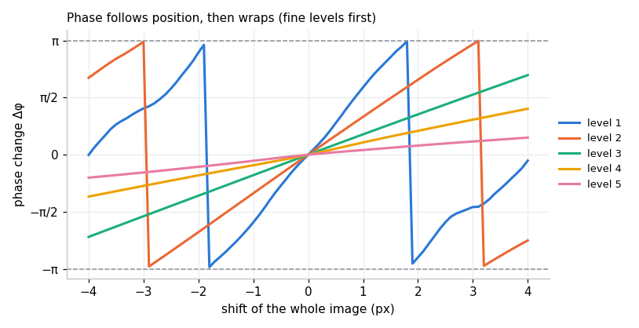
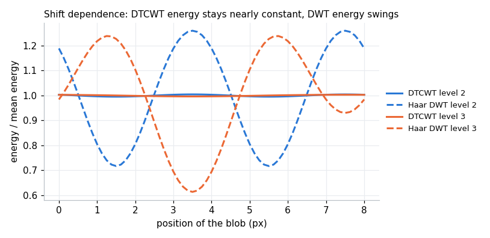
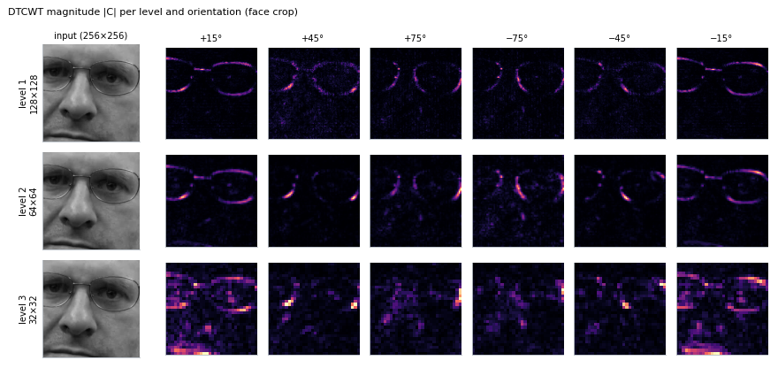
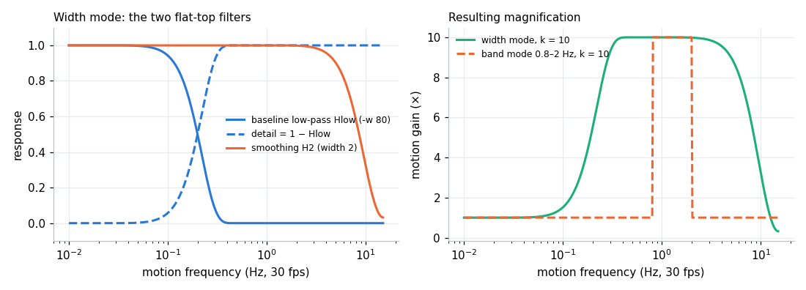
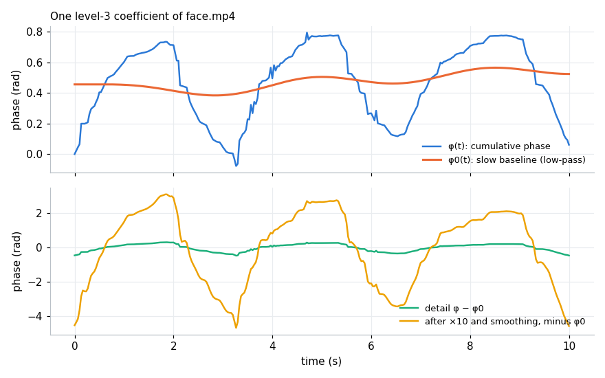

# How phase-based motion magnification with the DTCWT works

A tutorial for readers who want to understand the method, not just run it. It starts from what "magnifying motion" means and builds up to every step of `motion_mag.py`. Each claim is either derived here, cited, or measured in this repository; the figures are produced by [`scripts/make_theory_figures.py`](../scripts/make_theory_figures.py) from the real pipeline code.

**Suggested path through the repository**

1. This document, for the ideas.
2. [`MotionMagDtcwt.ipynb`](../MotionMagDtcwt.ipynb), to run the method on a real video and look at the result.
3. [`docs/research/synthetic-validation.md`](research/synthetic-validation.md), which checks the implementation against exact ground truth and measures its limits.
4. [`motion_mag.py`](../motion_mag.py): `magnify_motions` follows the steps below in order.

---

## 1. What "magnifying motion" means

Suppose a point in the scene moves by a tiny displacement δ(t): a skin surface moving with the pulse, a building swaying, a pipe vibrating. The displacement is well under a pixel, so the video looks still. Motion magnification produces a new video in which the same point moves by k·δ(t) for a chosen factor k, while the rest of the picture (texture, colour, lighting) stays as it was.

Two things make this hard. We never measure δ directly: all we have are pixel values. And we usually want to magnify only some motions, such as the pulse, and not others, such as slow drift or sensor noise.

## 2. Two families of methods

**Eulerian magnification** (Wu et al. 2012) looks at each pixel's intensity over time. For a 1D image I(x) moving by δ(t), a first-order Taylor expansion gives

  I(x + δ(t)) ≈ I(x) + δ(t) · ∂I/∂x.

The temporal change at a pixel is therefore proportional to the motion. Band-passing that change in time and adding it back α times gives I(x) + (1 + α)·δ(t)·∂I/∂x, which is approximately the image moved by (1 + α)·δ(t). The approximation only holds while the magnified motion is small compared with the image structure; Wu et al. give the bound (1 + α)·δ(t) < λ/8 for a sinusoid of wavelength λ. It also amplifies intensity noise by the same factor as the motion. The sibling repository [Eulerian-Video-Magnification](https://github.com/joeljose/Eulerian-Video-Magnification) implements this method.

**Phase-based magnification** (Wadhwa et al. 2013) does not approximate the image with its derivative. It decomposes each frame into localised, oriented, complex-valued sub-bands whose *phase* encodes position directly, and multiplies the change of phase. Because the motion is represented exactly within each sub-band, the method tolerates larger magnification and amplifies noise less; Wadhwa et al. report that it supports roughly four times larger magnification than the linear Eulerian method before artefacts appear. They used complex steerable pyramids; this repository follows Anfinogentov & Nakariakov (2016), who used the dual-tree complex wavelet transform (DTCWT) instead.

## 3. Local phase encodes position

Take a 1D pattern that is locally a sinusoid of angular frequency ω:

  I(x) = A · cos(ωx + φ).

Shift it right by δ:

  I(x − δ) = A · cos(ωx + φ − ωδ).

The amplitude A is unchanged and the phase drops by exactly ω·δ. The same holds for any image once it is split into band-pass pieces: each piece is dominated by frequencies near its centre frequency ω, and a small shift changes its phase by about ω·δ.

To read the phase we need a *complex* filter: a real filter such as a cosine gives A·cos(…), where amplitude and phase are mixed together, while a filter whose real and imaginary parts form a quadrature pair (a cosine-like and a sine-like wavelet) gives A·e^{i(…)}, from which amplitude and phase separate cleanly. Using wavelets instead of global sinusoids makes this *local phase*: each coefficient describes one small region at one scale and orientation. Fleet & Jepson (1990) showed that local phase is a robust carrier of image motion.

**Magnifying the phase magnifies the motion.** If a coefficient's phase changed by Δφ = −ω·δ because the image moved by δ, then replacing Δφ with k·Δφ is equivalent to moving it by k·δ. No derivative, no Taylor series: within one sub-band the shift is exact.

**The limit is the wavelength.** Phase is only known modulo 2π. Once the magnified phase change k·ω·δ passes ±π, it wraps around and the coefficient describes a shift in the *opposite* direction. The magnified displacement at each scale must therefore stay below half the scale's wavelength, λ/2 = π/ω, and in practice well below it.

The figure shows this on a real image: a crop of face.mp4 is shifted sub-pixel by sub-pixel, and the amplitude-weighted phase change of each DTCWT level is plotted. Each level is linear near zero with its own slope ω, and the finest levels wrap first.

Measured on that crop (nlevels 5):

| Level | Phase slope ω (rad/px) | Effective wavelength 2π/ω | Shift for a quarter turn (π/2) | Shift for a half turn (π) |
|---|---|---|---|---|
| 1 | 1.53 | 4.1 px | 1.0 px | 2.1 px |
| 2 | 1.05 | 6.0 px | 1.5 px | 3.0 px |
| 3 | 0.56 | 11.2 px | 2.8 px | 5.6 px |
| 4 | 0.32 | 19.6 px | 4.9 px | 9.8 px |
| 5 | 0.15 | 43.3 px | 10.8 px | 21.7 px |

This is where the practical rule "keep the magnified displacement under about 3 px" comes from: the two finest levels, which carry sharp edges, reach a half turn at 2–3 px. Beyond that, those levels wrap while the coarse ones are still correct, and edges fall short of their target and leave echoes. The synthetic tests measure exactly this (section 9).

## 4. The dual-tree complex wavelet transform

### Why not an ordinary wavelet transform

The ordinary discrete wavelet transform (DWT) is real-valued, so it has no phase to read. It is also strongly *shift-dependent*: because every level is subsampled by 2, moving the image by a pixel changes the coefficients a lot, and energy jumps between sub-bands and positions. The figure moves a small blob across the image in 1/8-pixel steps and plots the energy of one level. The Haar DWT's energy swings by 54% (level 2) and 62% (level 3); the DTCWT's stays within 1%.

### Two trees

Kingsbury's dual-tree transform (Kingsbury 1998, 2001; Selesnick, Baraniuk & Kingsbury 2005) runs two real DWTs in parallel, tree a and tree b. Their filters are designed so that tree b's wavelets are approximately the Hilbert transform of tree a's: the pair behaves like cosine and sine. Treating tree a as the real part and tree b as the imaginary part gives complex, approximately *analytic* wavelets. That provides the amplitude/phase split of section 3 and, because the two trees' sampling grids interleave, removes most of the aliasing that makes the DWT shift-dependent.

Two kinds of filters are used:

- **Level 1** uses biorthogonal filters with a one-sample offset between the trees. In this repository: `near_sym_a` (5 and 7 taps), `near_sym_b` (13 and 19 taps, the default), `antonini` (9, 7) and `legall` (5, 3), selected with `--biort`.
- **Levels 2 and up** use *Q-shift* filters, designed so that the two trees differ by a quarter-sample delay per level, which keeps them in quadrature at every scale. In this repository: `qshift_a` (10 taps), `qshift_b` (14, the default), `qshift_c` (16), `qshift_d` (18) and `qshift_06`, selected with `--qshift`.

Longer filters are smoother and more selective in frequency and orientation, at a small cost in speed. v2.0.0 switched the default from `near_sym_a`/`qshift_a` to `near_sym_b`/`qshift_b` because they produce fewer block artefacts at higher k.

### Two dimensions: six orientations

In 2D the transform filters rows and columns with both trees, giving four real outputs per level that combine into **six complex sub-bands**, each tuned to edges at about ±15°, ±45° or ±75°. A standard 2D DWT has only three real sub-bands and cannot tell +45° from −45°. The six orientations are what make the method isotropic: the synthetic tests find the same magnification in every edge direction to within 2–3%.

### Levels, sizes and redundancy

Each level halves the resolution in both directions: for an H×W frame, level l has about (H/2^l) × (W/2^l) × 6 complex coefficients, and after the last level a real *lowpass* image of size about H/2^n × W/2^n remains. Adding up the levels gives about 2 complex coefficients, i.e. 4 real numbers, per pixel: the 2D DTCWT is 4:1 redundant. That is the memory cost the pipeline has to hold for every frame (see the README's Performance section). Complex steerable pyramids are considerably more redundant, by an amount that depends on the number of orientations and the bandwidth of each band, which is why they are slower and larger; Wadhwa et al. (2014) introduced Riesz pyramids partly to reduce that cost.

`--nlevels` sets n. Level l has an effective wavelength of roughly 1.2–2 × 2^l pixels (see the wavelength table above), so more levels let coarse structures take part in the magnification, and each additional level halves the size of the unmagnified lowpass image (section 8). The default 8 suits 528×592 video.

## 5. Following phase over time

For every coefficient we need its phase φ(t) in every frame, as a continuous curve rather than values wrapped into (−π, π]. The pipeline:

1. normalises each coefficient to unit length, u(t) = C(t)/|C(t)|, keeping only the phase;
2. takes the frame-to-frame change with a conjugate product, Δφ(t) = angle(u(t) · conj(u(t−1))); this is always the short way round the circle, so it needs no unwrapping as long as the true change per frame is below π, which holds for the tiny motions this method is for;
3. accumulates: φ(t) = angle(u(0)) + Σ Δφ. The sum is the unwrapped phase history.

A coefficient that is exactly zero (a perfectly flat region) has no phase; the conjugate product gives angle(0) = 0, i.e. no motion, which is the right answer. An earlier version divided the coefficients instead and produced NaN there, which appeared as black patches (issue #22).

## 6. Choosing which motion to magnify: temporal filtering

The phase history φ(t) of a coefficient contains everything that moved it: slow drift of the camera or the subject, the oscillation we care about, and noise. Temporal filtering decides which part is multiplied by k. The pipeline offers two ways.

### Width mode (default, `-w`)

This mode follows Anfinogentov & Nakariakov's implementation. It uses two low-pass filters built from flat-top windows (`scipy.signal.windows.flattop`), whose frequency response is extremely flat in the passband, so amplitudes of the oscillations kept are preserved accurately, at the price of a wide transition band.

- A long low-pass Hlow (length `round(width / 0.2327)`, forced odd; 345 frames for the default width 80) gives the slow baseline φ0(t). What remains, φ − φ0, is the *detail*: everything faster than the baseline.
- The detail is multiplied by k and added back: φ0 + k·(φ − φ0).
- A short low-pass H2 (width 2, 9 frames) removes the fastest fluctuations, mostly noise.

For a motion at frequency f the gain is therefore

  G(f) = H2(f) · [1 + (k − 1) · (1 − Hlow(f))],

a band-pass that is 1 for slow motions, k in the middle and falls off for fast ones. At 30 fps with the defaults, the half-amplitude points are about 0.20 Hz and 8.6 Hz. The factor 0.2327 is an empirical width-to-length constant carried over from the reference IDL implementation, not the window's equivalent noise bandwidth (which is about 3.77 bins). Both filters are *zero-phase* (symmetric, odd length), so the magnified motion is not delayed relative to the original; an even-length window used to shift it by half a frame (issue #29).

### Band mode (`--freq-low`, `--freq-high`)

Here the detail is an ideal temporal band-pass BP of the phase, computed with an FFT, and the update is

  φ̂ = φ + (k − 1) · BP(φ),

so motion inside [f_low, f_high] is multiplied by k and everything else is left exactly as it was. Before the FFT the phase history is extended symmetrically by its own length at both ends so that the transform's implicit periodicity does not join the last frame to the first. A clip of N frames at a given fps can only separate frequencies about fps/N apart (0.1 Hz for a 10-second clip); a band narrower than that gives unreliable gain, and a band that contains no frequency bin at all is rejected before processing. Band mode is the better choice when the frequency of interest is known, because a narrow band magnifies less noise.

### What it looks like for one coefficient

A strong level-3 coefficient of face.mp4 (chosen automatically as the one with the most amplitude-weighted detail motion): the cumulative phase φ(t), its slow baseline φ0(t), the detail, and the detail after magnification by 10 and smoothing. Its main oscillation has a period of about 3.3 s (≈ 0.3 Hz), slow head motion rather than the pulse; with the default width it falls inside the magnified band (0.2–8.6 Hz). A pulse-only result would use band mode, e.g. `--freq-low 0.8 --freq-high 2`.

The magnified detail reaches ±3 rad, close to half a turn. The finer levels, with shorter wavelengths, pass the wrap-around limit of section 3 before this one does, which is why k = 10 on face.mp4 shows echoed edges on the thin glasses frames.

## 7. Reconstruction

Each coefficient is rebuilt with its original amplitude and the new phase, |C(t)| · e^{iφ̂(t)}, and the inverse DTCWT turns the modified coefficients back into a frame. Keeping the amplitude means textures keep their contrast and nothing is brightened or darkened by the magnification itself, which is one reason the method produces fewer intensity artefacts than Eulerian magnification.

## 8. What is not magnified: the lowpass residual

The last lowpass image of the DTCWT has no phase, so it passes through unchanged. Any part of a motion that is represented there is not amplified. For thin lines and fine texture this is negligible, but for large, smooth or blurred structures a noticeable share of the motion lives in the lowpass: on the synthetic tests a filled circle moves about 0.88k at 5 levels and 0.92k at 7, and a softer edge loses more. More levels shrink the lowpass image and reduce the loss, so use the largest `--nlevels` the frame size allows.

## 9. Checking the implementation

Because real videos have no ground truth, the repository checks the method on synthetic pulsating shapes whose correct magnified version is known exactly ([research notes](research/synthetic-validation.md), [tests](../tests/test_synthetic_shapes.py)). In summary:

- the measured gain follows G(f) from section 6 at every frequency from 0.1 to 12 Hz, with zero phase lag;
- band mode gives about k inside the band and exactly 1 outside;
- k = 1 returns the input;
- all edge directions are magnified alike;
- the two systematic effects are the lowpass residual (section 8) and wrap-around beyond ~3 px of magnified displacement (section 3).

## 10. Colour

Motion is carried almost entirely by brightness. By default (`--color-space rgb`) the pipeline magnifies R, G and B separately, which triples the work and lets the three channels' phases drift apart at high k, visible as colour fringes. With `--color-space yiq` only the luma Y = 0.299R + 0.587G + 0.114B is magnified. Converting to YIQ, replacing Y and converting back changes R, G and B by the same amount ΔY (the Y column of the inverse YIQ matrix is all ones), so the chroma (I, Q) is kept exactly.

## 11. Choosing parameters

- **Frequency band.** Pick the band of the motion you want: pulse about 0.8–2 Hz, breathing 0.15–0.5 Hz, a machine at its rotation or mains frequency. The upper edge must be below half the frame rate. Use band mode when you know the band.
- **Magnification k.** Estimate the real displacement and keep k·δ below about 2–3 px (section 3). A very subtle pulse may tolerate k = 20 or more; a visible sway may only allow k = 2–3. Larger k on too large a motion produces echoes, not more motion.
- **Levels.** As many as the frame allows; the default 8 suits roughly 500×500 and up.
- **Filters.** The defaults (`near_sym_b`, `qshift_b`) are a good balance; the shorter `near_sym_a`/`qshift_a` reproduce v1.x output.
- **Noise.** For noisy, low-contrast video, `--phase-sigma 1` smooths the magnified phase over neighbouring coefficients, weighted by amplitude (after Wadhwa et al. 2013). It lowers the noise but also costs some magnification of clean edges ([measurements](research/synthetic-validation.md#4-the-39-proposals)).

## 12. How the approaches compare

| | Eulerian (Wu et al. 2012) | Phase, complex steerable pyramid (Wadhwa et al. 2013) | Phase, Riesz pyramid (Wadhwa et al. 2014) | Phase, DTCWT (this repository) |
|---|---|---|---|---|
| Quantity magnified | pixel intensity change | local phase | local phase (from a Riesz transform) | local phase |
| Motion model | first-order Taylor | exact within each sub-band | approximately exact | exact within each sub-band |
| Magnification limit | (1 + α)·δ < λ/8 | larger, about 4× per the authors | similar to steerable | half a wavelength per level; ~2–3 px at the finest levels |
| Noise | amplified with the signal | translated rather than amplified | similar to steerable | as steerable; optional amplitude-weighted smoothing |
| Orientations | none | configurable | from the Riesz transform | 6 fixed (±15°, ±45°, ±75°) |
| Redundancy / cost | low | high | low; designed for real-time use | 4:1; fast |

## 13. Glossary

- **Amplitude, phase**: the length and angle of a complex coefficient C = A·e^{iφ}. Amplitude measures how much structure of that scale and orientation is present; phase measures where it sits.
- **Local phase**: the phase of a localised (wavelet) filter response, describing position within one small region at one scale.
- **Analytic / quadrature pair**: two filters shifted by 90° in phase (cosine- and sine-like), whose combination gives a complex response with a clean amplitude and phase.
- **DTCWT**: dual-tree complex wavelet transform; two real wavelet trees forming an approximately analytic complex transform.
- **Q-shift filters**: the DTCWT's filters for levels 2 and up, with a quarter-sample delay between trees.
- **Level (scale)**: one octave of the transform; level l is subsampled by 2^l.
- **Lowpass residual**: the coarse image left after the last level; it has no phase and is not magnified.
- **Shift invariance**: coefficients (or their energy) not changing much when the input shifts; the DTCWT has it approximately, the DWT does not.
- **Wrap-around**: phase passing ±π and reappearing at ∓π, so a large magnified shift is read as a shift in the wrong direction.
- **Band (temporal)**: the range of motion frequencies that is magnified.
- **Frequency resolution**: fps / number of frames; the smallest frequency difference a clip can separate.
- **Zero-phase filter**: a symmetric filter that does not delay the signal.
- **Luma**: the brightness component Y of a colour video.

## 14. Further reading

1. Wu, H.-Y., Rubinstein, M., Shih, E., Guttag, J., Durand, F. & Freeman, W. T. (2012). Eulerian Video Magnification for Revealing Subtle Changes in the World. *ACM Transactions on Graphics (SIGGRAPH)* 31(4).
2. Wadhwa, N., Rubinstein, M., Durand, F. & Freeman, W. T. (2013). Phase-Based Video Motion Processing. *ACM Transactions on Graphics (SIGGRAPH)* 32(4).
3. Wadhwa, N., Rubinstein, M., Durand, F. & Freeman, W. T. (2014). Riesz Pyramids for Fast Phase-Based Video Magnification. *IEEE International Conference on Computational Photography (ICCP)*.
4. Anfinogentov, S. & Nakariakov, V. M. (2016). Motion Magnification in Coronal Seismology. *Solar Physics* 291(11), 3251–3267.
5. Kingsbury, N. G. (1998). The Dual-Tree Complex Wavelet Transform: A New Technique for Shift Invariance and Directional Filters. *IEEE DSP Workshop*.
6. Kingsbury, N. G. (2001). Complex Wavelets for Shift Invariant Analysis and Filtering of Signals. *Applied and Computational Harmonic Analysis* 10(3), 234–253.
7. Selesnick, I. W., Baraniuk, R. G. & Kingsbury, N. G. (2005). The Dual-Tree Complex Wavelet Transform. *IEEE Signal Processing Magazine* 22(6), 123–151.
8. Fleet, D. J. & Jepson, A. D. (1990). Computation of Component Image Velocity from Local Phase Information. *International Journal of Computer Vision* 5(1), 77–104.
9. Portilla, J. & Simoncelli, E. P. (2000). A Parametric Texture Model Based on Joint Statistics of Complex Wavelet Coefficients. *International Journal of Computer Vision* 40(1), 49–70 (the complex steerable pyramid).
